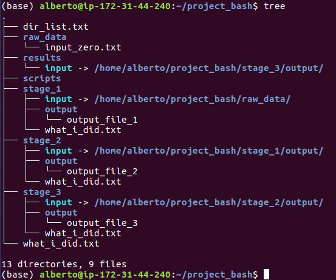

# Applications of Genomics in Wildlife Conservation

## Day 1 - Session 1 - Basic concepts of command line programming

### 1. Working from terminal and remote servers
In this section, we will outline the procedure for connecting to our cloud server and provide you with some essential preliminary definitions.

### 2. The filesystem 
This section outlines the basic commands for navigating file systems and creating a structured directory hierarchy for research projects. The naming of files and directories is more crucial than you might realize; a clear and consistent structure will significantly streamline your workflow, especially when dealing with complex projects and pipelines. While you can adapt and customize this template structure to your specific needs, adhering to these principles will greatly enhance project organization and accessibility.

We will start with creating a parent directory for our project. 
```sh
mkdir Project_BASH 
cd Project_BASH
```
The first command (`mkdir`) creates the required folder while the `cd` command is used to move from your home directory to the new directory. Now we need to create one directory where we are going to store our scripts, one for the raw data, and one for our results:

```sh
mkdir Scripts; mkdir Raw_Data; mkdir Results
```
note the use of the semicolon (;) to separate different commands on the same line.
> `Tip`: never use white spaces when naming files or directories

Then, we need to create a separate directory for each stage of our pipeline/analysis. Because of my lack of immagination, each directory will be termed as `Stage` and we are going to number them sequentially but I would encourage you to use a better naming
convention when it comes to your research. Given that typing the same command over and over is tedious, we are going to use one of the basics building blocks of any programming language: a loop.  

```sh
for i in $(seq 3)
do
mkdir Stage_$i
done
```
Let's unpack this programming structure:

The reserved word `for` is what signals the shell that the following commands need to be repeated.

The letter `i` is our iterator, the loop will stop when this variable has taken all the values in the array generated by the command `seq`. As you have probably figured out already, `seq 3` will generate a sequence of integers from 1 to 3 (included).  

In order to make this sequence available to the for loop, so that the machine will no when to stop, we use the bash syntax `$(command)` which roughly speaking means "insert here the output of the command in brackets". 

We then used the iterator (i) to name our directories. Because at each iteration i is going to assume a different value, we used the standard notation for variables in our mkdir command: $i.

Now let's look at what we have done: to list the content of a directory use the command `ls`.

For the sake of reproducibility, it is always a good idea to keep track of everything we do. I recommend you always log your command to a file keeping a consitent naming convention. Here we are going to call our log files `What_I_did.txt` and in order to create such files we will use the command `touch`. 

Each of our `Stage` directories should contain at least three items:
- a What_I_Did.txt file.
- an Output sub-directory
- a sub-directory called Input

In principles, you could navigate to the each Stage directory using the `cd` command and create these objects manually but that involves a lot of typing. You should instead use a loop to avoid this tedious task. An efficient way to do this from a shell terminal requires to create a list of parent directories and then create the child directories only where we need them.
```sh
ls -d Stage* > dir_list.txt
```
Note the use of the `>`. This symbol in bash has a special meaning: redirect the output of the command that precedes it to a file.

Now that we have the list, we can easily implement another type of loop using the reserved word `while`:
```sh
while read -r line
do
touch $line/What_I_Did.txt
done < dir_list.txt
```
note again the use of the `$` sign in front of the word `line` which is the syntax for variables in bash. This is because at each iteration the content of the variable `line` will change while we go through the list of directories contained in the `dir_list.txt` file. the loop will end when the variable `$line` is empty i.e. when we reach the end of the file.

> `Exercise 1`
>
> use a similar while loop to create a sub-directory called `Output` inside each Stage dir

If your pipeline is run sequentially, the output of the first step will serve as input for the second step and so on and so forth. Therefore, the content of `Stage 1/Output` and `Stage 2/Input` will be exactly the same. Avoiding redundancies and data duplication is a good way of saving space on disk though, thus, we don’t want to copy all the files from one directory to another: we are going to create a symbolic link instead.
```sh
ln -s ~/Project_BASH/Raw_Data/ ~/Project_BASH/Stage_1/Input
```
The `ln` command stands for ”link” and it has this general syntax:
```sh
ln full/path/to/source full/path/to/destination/link_name
```
Here we have used the `-s` flag to specify a symbolic link between the `Raw_Data` directory and a new `Input` folder (link name) inside the `Stage_1 directory`. This means that the content of `Raw_Data` is now accessible from `Stage_1/Input`. Let’s double-check it:
```sh
touch Raw_Data/input_zero.txt
ls Stage_1
ls Stage_1/Input
ls Raw_Data
```
The first command is just to pupulate the Raw_Data folder with a file (`input_zero.txt`). By running the second command you should see that an Input folder has been created via the `ln` command. Now the Stage_1 directory contains all three elements required. The output of the third and fourth commands should be just `input_zero.txt`.

> `Exercise 2`
>
> Use the ln command to complete our file system structure
> by linking each `Stage_{i}/Output` to an Input folder inside the `Stage_{i+1}` directory.
> Note that in our example Stage 4 is actually termed Results.

If you have made a mistake with links, do not panic. You can alwayse remove them with `rm` or with the `unlink` command.

Now that we have a good structure we can start populating our directories. Let's create some files in the `Project_BASH` directory.

```sh
for i in $(seq 3)
do
touch output_file_$1
done
```
Now we should move each of these file to the corresponding `Stage_{i}/Output` directory.

> `Exercise 3`
>
> Use a for foop to move each of the output_file_{i} ∀i ∈ {1, 2, 3} to its own directory.
> 
> To do so, you should use the `mv` command which has the following syntax: `mv target_file_name path/to/destination`.


If you now run the `tree` command from the Project_BASH directory, you should get:



### 3. Regular expressions & file manipulations
In this section we are going to apply what we already know about variables, conditional and loops to explore text files. 
We will mostly focus on file manipulation using regular expressions, using `grep`, `sed` and `awk`.

Let’s start with opening a new terminal, connecting to the VM and look at the file called `random.fasta`:
```sh
cd /home/Data/Day_1/
less random.fasta
Press Q to exit.
```

As the name suggests, this file contains some random DNA sequences of different length stored in a commonly used format for this kind of data. 
As you can see, each entry consists of two lines: a header (with the sequence identifier) and a second line containing the actual sequence.
Thus, if we were wondering how many DNA sequences are present in that file, we can just run:
```sh
wc -l random.fasta
```
and divide this number by two.

Now, let’s look at the first 7 entries which correspond to the first 14 lines of the file.
We can easily print them on screen using:
```sh
head -14 random.fasta
```

If instead we were interested in the last 4 entries, we could have run:
```sh
tail -8 random.fasta
```
Or we could a combination of these two commands to extract a contiguous block of sequence:
```sh
head -20 random.fasta | tail -4
```
With the last command we have selected the 9th and 10th entries corresponding to the lines from 17 to 20 in our fasta file.
The vertical bar (`|`) is called `pipe` and it is used to connect the two commands (`head` and `tail` in this case). 
Specifically, it redirects the standard output of the first command which then serves as input for the second command.

Piping the output of head into tail or vice versa is a simple way to extract a block of lines
but it becomes very slow if the file you are dealing with is huge. An alternative is using
sed. Let’s consider the following commands:

```sh
sed -n '9,12p' random.fasta
sed -n '9,+3p' random.fasta
```
These are alternative ways of printing a range of lines. In this case we are printing lines
from 9 to 12 which of course correspond to our 5th and 6th entry.

It is unlikely though that we will know in advance the line numbers of the entries that are
relevant to our analysis. Most of the time will have to parse the file and look for patterns.
That’s when regular expressions (`regex`) become very useful.

As you may have noticed, all header lines in random.fasta start with `>seq` followed by a
number, `Hg`, and a letter, separated by underscores. The string `Hg` stands for haplogroup
(A,B,or C) and we might be interested in knowing how many reads we have for each
group. We can retrieve these number by running:

```sh
grep '>seq.*_Hg_A' random.fasta | wc -l
```
Let's unpack this command:

`grep` stands for "global regular expression print" and it has the following syntax
```sh
grep 'regex' target_file
```
In our example the regex or the pattern that we are looking is obviously `>seq.*_Hg_A`. 
This regular expression is designed not to match a unique sequence of character but rather a series of sequences that are similar to each another.
In fact, this regex will match any line containing the string `>seq` followed by any character (represented by the `.` symbol) that appears zero or more times (`*`), 
followed by the string `_Hg_A`. Thus, `grep` will print all the header lines in the random.fasta corresponding to haplogroup A and this output is the piped (|) 
into the command `wc -l` which simply counts the number of matching lines.

> `Exercise 4`
>
> Find out how many sequences we have for each group by modifying the pattern of the grep command above.

We can also use regex inside a sed command. For example, let's extract the 3rd sequence of each haplogroup:
```sh
sed -n '/seq_3_/,+1p' random.fasta > /home/your-user-id/Project_BASH/Raw_Data/third_seq_all_Hg.fasta
```
As you can see, it looks very similar to the sed command we used before with the exception that instead of providing sed with specific line number, 
here we have specified a pattern (`/seq_3_/`) and asked the program to print eachh matching line plus and the following one: (+1p). 
Finally, we have redirected the output to store this information into a file called third_seq_all_Hg.fasta.

> `Exercise 5`
> 
> Now navigate to your `Raw_Data` directory and visualise the content of the file on screen using the command `cat name-of-the-file`.

Let’s have a look at a different file format and keep on experimenting with regex. 
In the`/home/Data/Day_1` folder you should see a file called `dog_genes.gtf` 
which is a tab separated file containing annotations for some coding sequences in the dog genome.
We can have a look at the header (lines starting with #) by running:
```sh
grep '^#' /home/Data/Day_1/dog_genes.gtf
```
> `Exercise 6`
>
> Create an headerless version of this file using the ”select non matching lines” option of grep (-v flag)
> and redirect the output to a file called `dog_genes_no_H.tsv` inside the Stage_1/output directory.

The first line of your headerless file should be as follows:
`X ensembl gene 1575 5716 . + . gene_id "ENSCAFG00000010935"; gene_version "3"; gene_source "ensembl"; gene_biotype "protein_coding"`
It contains a lot of information that is not relevant for us at the moment. 
The fields that we are interested in are:
- The chromosome (X: 1st field)
- The type of the feature (gene: 3rd field)
- The starting position of the feature (1575: 4th field)
- The ending position of the feature (5716: 5th field)

> `Exercise 7`
> 
> Use `cut` to extract the required fields from dog_genes_no_H.tsv.
> Then redirect the output to a file called `dog_genes_table.tsv` inside your `Stage_2/Output/` directory.
> See cut --help to identify the option for fields

Now that we have extracted the relevant information, we would like to make a few adjust-
ments to our table. Let’s start with adding a string at the beginning of each line:
```sh
cd Stage_2/Output/
sed -i 's/^/chr_/' dog_genes_table.tsv
```
Here we have used the substitution command of sed (`s`) and modified the file in-place (`i`).
The substitution command has the following syntax:
```sh
sed 's/target/replacement/'
```
In our example, the caret symbol (^) denotes the beginning of a line and 
we replaced this with `chr_`. You can check whether the substitution
worked or not by examining the first 10 lines of the table with head.

The next thing we would like to do is switching the order of the columns in our table:
- 1. Chromosome
- 2. Starting Position
- 3. Ending Position
- 4. Feature Type
This requires a simple awk command:
```sh
awk 'BEGIN {OFS="\t"};{print $1,$3,$4,$2}' Stage_2/Output/dog_genes_table.tsv > Stage_3/Output/d_g_tab_cfp.tsv
```

The OFS option before the print command stands for ”Output Filed Separator” and we set
it to Tab (`\t`) to ensure our table has the correct delimiter for a ”tab separated file” (TSV).
`awk` stores each field in a different variable which is accessible via the `$` symbol. 
We made use of this feature to put the columns in the rigth order.

We are almost done with pre-processing our data but there’s still something that’s not
quite right with it. Have a look at the first column:
```sh
cd Stage_3/Output
cat d_g_tab_cfp.tsv | cut -f 1
```
Have you noticed that the chromosomes are not in the right order? Let’s fix it!
```sh
sort -V -o ../../Results/d_g_sorted_table.bed d_g_tab_cfp.tsv
```

Here we used the -V option because we are dealing with a mixture of numerical and string
data. Note also the -o to specify the output file which must precede the input.
Our table is now ready to be analysed. Hurray!!!

> `Bonus Exercise`
> 
> How many coding regions (CDS) on the X chromosome are listed in our bed file?
> 
> Use the commands you have learn to find out   

