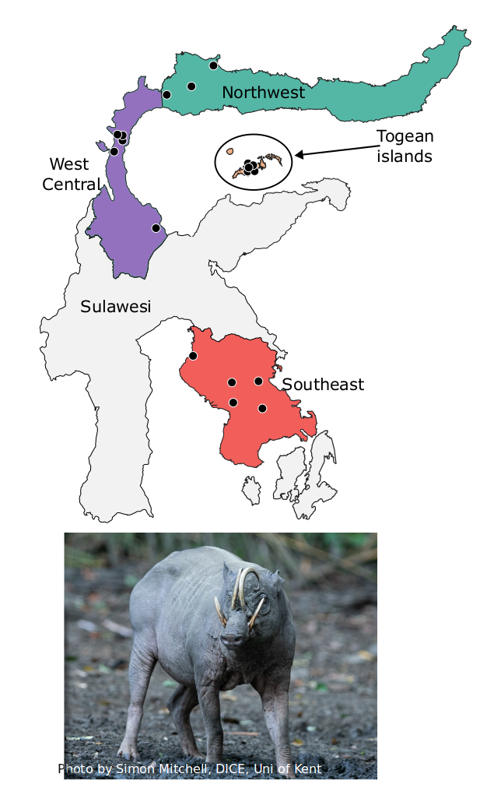
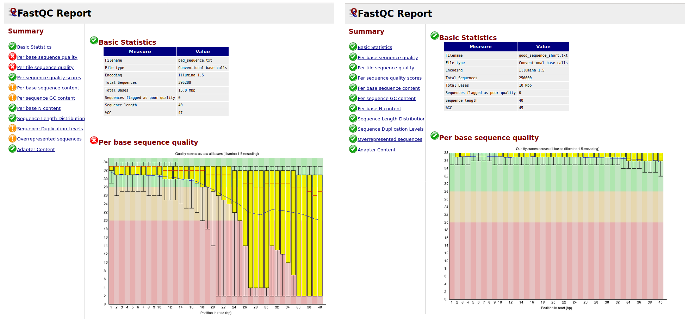

# Applications of Genomics in Wildlife Conservation

## Day 2 - NGS data processing - Session 1
In this session you will learn how to process genomic data generated with high-throughput sequencing technologies.

Before we start, let's organize yesterday's material and prepare the directory structure for today.
Please connect to the server either via `putty` or via the `ssh` command then run:

```sh
cd; mkdir day1; mkdir day2;
mv ~/session2 ./day1/
mv ~/project_bash ./day1/
cd day2
mkdir qc; mkdir bams; mkdir vcfs; mkdir fastqs; mkdir scripts; mkdir lists
touch what_i_did.txt
```
You should now be in the `~/day2/` directory, run `ls -lh` to ensure that all sub-directories have been created.

Let's now create a symbolik link to the directory containing the input data for the tutorial:

```sh
ln -s /home/DATA/Day_2/ ./raw_data
```

Finally, we need to activate the conda environment to access all software we will need:

```sh
conda activate Day_2
ls ~/day2/raw_data/
```

In your `raw_data` folder you should now see 8 files with the `.fastq` extension. These are the results of pair-end sequencing on Illumina HiSeq X platform of 4 babirusa individuals (one from each region of Sulawesi plus the Togean Islands as shown on the map). We are now going to familiarise with this file format and then evaluate the quality of these sequencing results.



#### Fastq format
Genomic information from high-throughput sequencing are stored in text-based files called
FASTQ. These files comprise a series of entries containing not only the sequence but also
its quality score. Each entry consists of four lines as shown in the box below.

```sh
@HiSeq 4000:1:FCX:4:15:66:165 2:N:0:7
ATTTAGTACCATGACATGACACATACTACAATTGACGACATCAATCA
+
IGHFDEC@;;?=>B=?<;A:?@>9<>9756867544312*,*)'&)+
```

The first line (or header line) starts with `@` and contains a series of characters which uniquely identify the read. 
When dealing with Illumina data, the identifier includes 7 fields encoding information about the sequencing process plus 4 fields about the read itself (see tab2.1).
Fields are separated by a `:` and the two groups are separated by a space.

Table 2.1: Fastq format – Fields in the Sequence ID line
| Field | example|
| ------ | ------ |
| Instrument used for sequencing|HiSeq 400|
| Run Number on that instrument|1|
| flow cell ID | FCX |
| lane number | 4 |
| tile number | 15 |
| X coordinate of cluster| 66 |
| Y coordinate of cluster| 165 |
| read number | 2 (2nd read of the pair) |
| is filtered | N (Y did not pass, N otherwise) |
|control number| always zero on HiSeq X |
|sample number| 7 (the 7 th sample in the pool) |

The second line contains the actual sequence (in the example above, a short fragment of 47 nucleotides). Most Illumina sequencers however are ran on 150 cycle these days which means they produce 150bp reads. 

We call a cycle when the sequencer takes a picture of a new nucleotide that is added during the seqencing by synthesis reaction - this for example is 3 cycles (sequencing 3 nucleotides):


The third line always starts with a `+` to improve the readability of the file by separating the
sequence line from its quality. The + symbol might be followed by the read identifier in
the first line (optional).

The forth line consists of a series of characters that encode the Phred-score (Q) for each
base in the sequence on the second line of the entry. Broadly speaking, Phred scores
are a measure of how confident we are in calling a given base.

Let P denote the probability of identifying the wrong nucleotide. Then, the Phred quality
scores Q are defined as:

Q = −10 log<sub>10</sub> P

Thus, if a base has an assigned Q-score of 20, it means that the chance that we have
called the wrong base are 1 in 100 i.e. the base call accuracy is 99%.

The quality scores represent how sure the sequencer is about the base - for example here in this picture, how bright is the fluorescence: 


In some cases the signal is very poor and so the sequencer won't be very sure this is A, a T, a G or a C - so the sequencer will give this base a bad quality score. 

In the example above, the first base of the sequence is an A. The corresponding quality
of the base calling is encoded as `I` (first character on line 4). The symbol `I` corresponds
to a Q-score of 40 (see table 2.2) which means that the base call accuracy of the first
position in the sequence is 99.99%.

Table 2.2: Illumina Phred-score encoding
|Symbol|Q-score||Symbol|Q-score||Symbol|Q-score||Symbol|Q-score|
|----|----|----|----|----|----|----|----|----|----|----|
|!|0||,|11||7|22||B|33|
|”|1||-|12||8|23||C|34|
|#|2||.|13||9|24||D|35|
|$|3||/|14||:|25||E|36|
|%|4||0|15||;|26||F|37|
|&|5||1|16||<|27||G|38|
|’|6||2|17||=|28||H|39|
|(|7||3|18||>|29||I|40|
|)|8||4|19||?|30|
|*|9||5|20||@|31|
|+|10||6|21||A|32|


> Question 1:
>
> What's the accuracy of the last base call in the example above? 

#### Quality Control

Assessing the quality of sequencing results is a crucial step in genomic analysis. 
If your initial input are problematic, all downstream analysis might suffer from various biases and in general your inference will be less reliable.
In this tutorial we are going to use a `FASTQC` which is a program designed to spot potential problems in high througput sequencing data. you can read more about this software here:(https://www.bioinformatics.babraham.ac.uk/projects/fastqc/)

The program will analyse a fastq file and produce a html report that can be visualised in a web-browser. Each tab in the FASTQC report will show different aspects of the quality of the sequencing but the `Per base sequence quality` is one of the most important. 

> Question 2:
>
> In the figure below you can see two examples of very different quality control results. Can you guess which dataset is better?
 


Lets run `fastqc` on our own data, shall we?

The command to run fastqc is straightforward:
```sh
fastqc -t 1 ~/day2/raw_data/sub_RD56_1.fastq -o qc
```
where `-t 1` corresponds to the number of threads used for the analysis, and `-o qc` corresponds to the output directory where the program will store the report.

In principle we could run this command for the other 7 files in our initial dataset by manually changing the file name every time. Given that this is quite tedious, we are going to make use of what we learnt yesterday and use a loop instead. First of all let's make a list of input files:

```sh
ls ./raw_data/*.fastq > ./lists/fastq_list.txt
```
You can inspect this list as usual using either the command `cat` (to print it on screen) or `less` (press q to exit).
Now that we have our list of files, we are going to run all the quality control analysis sequentially (one after the other) using our `while` loop:

```sh
while read -r line
do
fastqc -t 1 $line -o qc
done < ./lists/fastq_list.txt
```
We could also run this without a list of files as: 

```sh
for i in ~/day2/raw_data/*.fastq
do
fastqc -t 1 $i -o qc
done
```
Once completed, use either the PSFTP app or the sftp command to transfer the .html files to your local computer and visualise them in your web-browser.
After establishing the sftp connection you can run:
```sh
cd ~/day2/qc/
lcd path/to/download/folder
get *.html
```

> Question 3:
>
> How many reads do we get for each individual?

#### Removing Adapters
In most cases when your DNA is of very good quality (e.g. DNA was extracted from fresh blood) the DNA fragements are usually larger than Illumina reads of 150bp. This is not always the case, and in some case the DNA insert will be shorter than the read length. This means that you will end up sequencing adapter sequences. Look at this diagram below:


If the dna insert (in gray; the DNA we are interested in) is shorter than the read length (e.g. 150bp) then the sequencer will sequence what comes after i.e. the adapter. 

This is particularly an issue if your DNA is degraded, for example, if it is coming from an non-invasive sample like hair or feaces, or even bone. In this case we would want to remove the adapter sequence so that you only work with the DNA we are interested in: the part in gray in diagram above. Having adapter sequences in reads can lead to issues with mapping and genotyping later on. If you do not understand this please speak to a instructor so they can help you. 

There are many software available that can perform this task, here we will focus on `AdapterRemoval` (https://adapterremoval.readthedocs.io/en/stable/). 
The main reason why we present this software in this workshop is because it not only search and remove adapters from high-throughput sequencing data but it can also perform the colllapsing of the two reads if necessary. 

Collapsing reads should be avoided when dealing with modern DNA given that the DNA molecules present in the library are longer than the read size (normally 150 bp for Illumina) hence the forward and reverse sequencing product do not overlap. Merging the overlapping region of the two reads is instead the standard procedure when analysing shorter DNA fragments which is always the case when dealing with degraded DNA such as DNA extracted from archaeological specimens or museum collections. 

Lets look at the same diagram below this time for paired end reads. Lets say the gray DNA insert is 300bp and you sequencing 150bp paired end (the most common type of Illumina sequencing). You first sequence using read1 primer (in orange) then you sequence using read2 primer in the last diagram. If you sequence 150bp each time and the insert is 300 bp then you don't have any overlap between the sequencing reads. Now lets say you insert is only 50bp. In both read1 and read2 you'll end up sequencing the whole 50bp (so sequence it twice) and you will sequence adpaters on both sides of the DNA molecule:


`Adapterremoval` can do both, remove the adapters and collapse the 50bp fragment you sequenced twice so you get only 1 reads at the end.  

> Question 4:
>
> What do you think the index primers are for? 

`Adapterremoval` can also do quality trimming. This involves removing low-quality bases from the ends of reads (e.g. see how bad the quality is at end of the reads in the first fastqc example).


```sh
AdapterRemoval --file1 reads_1.fq --file2 reads_2.fq --basename output_paired --trimns --trimqualities
```
If working with ancient DNA (aDNA), you can add the `--collapse` option to merge the two reads and adjust the quality score accordingly.

As for the quality control step, we could run the command above 4 times, each time editing manually the file name for read_1 and read2 and changing the output name (`--basename`). 
In this case is feasible because we are only dealing with 4 samples but imagine a scenario in which you have a dataset that comprises hundreds of individuals, doing this manually would be not only unefficient the chances that you can by accident forget to process a sample or inputing the wrong sample name increase exponentially. Thus, let's transform this command into a script!

First of all let's create a file in our `script` directory
```sh
touch ~/day2/scripts/remove_adapters.sh
```
Then, we should transform this into an executable:
```sh
chmod 770 ~/day2/scripts/remove_adapters.sh
```

Now let's edit this file using nano: 
```sh
#!/usr/bin/bash
INPUT1=
INPUT2=
OUTPUT=
AdapterRemoval --file1 $INPUT1 --file2 $INPUT2 --basename $OUTPUT --trimns --trimqualities
```
Here we have just set three variables (INPUT1, INPUT2, OUTPUT) but we still need to find a way to assign to these variable the right file name. 
If we would like to pass the file names as positional arguments we could do someting like this:

```sh
#!/usr/bin/bash
INPUT1=$1
INPUT2=$2
OUTPUT=???
AdapterRemoval --file1 ${INPUT1} --file2 ${INPUT2} --basename ${OUTPUT} --trimns --trimqualities
```
But what should we assign to the variable OUTPUT? 

Ideally we would like to keep a consistent naming convention which retains the same information about the sample name that is present in each of the input files.
One possibility is to employ the `basename` command which separates a file name from its path. Note that the --basename flag in `AdapterRemoval` and this shell command are two different thing! Try to run for example: 
```sh
basename /home/DATA/Day_2/sub_RD59_1.fastq
```

> Question 5:
>
> What's the output of the command above?

We can now modify our script and assign to the last variable the `correct` value.

```sh
#!/usr/bin/bash
INPUT1=$1
INPUT2=$2
OUTPUT=$(basename $1)
AdapterRemoval --file1 ${INPUT1} --file2 ${INPUT2} --basename ~/day2/fastqs/${OUTPUT} --trimns --trimqualities
```
At this stage, the usage of this script should be:

```sh
./scripts/remove_adapters.sh path/to/read1/file.fastq path/to/read2/file.fastq
```

> `Exercise 1`
>
> Try to run the script to remove adapters for one sample by inputing the right paths for both the read1 and read2 files.
> Have a look at the output inside the `fastqs` directory.
> Do you see anything that can be improved in our file naming convention?

As you probably have noticed, the first part of the output name looks exactly as the first input file name. 
Also the .fastq extension appears in the middle and we might want to get rid of that part.
We can use a little trick to adjust this. Let's modify our script for the last time!

```sh
#!/usr/bin/bash
INPUT1=$1
INPUT2=$2
OUTPUT=$(echo `basename ${INPUT1}` | sed 's/_1.fastq//')
AdapterRemoval --file1 ${INPUT1} --file2 ${INPUT2} --basename ~/day2/fastqs/${OUTPUT} --trimns --trimqualities
```

> `Exercise 2`
>
> Run the last version of our script to remove adapters using the same input files you have used before.
> Have a look at the output inside the `fastqs` directory. Do you see the difference?

We are now finally ready to run the `adapteremoval` step for all our sample. 
We are going to use the same stratagy we have employed for the quality control step i.e. the while loop.
First of all let's remove our experiments with the naming by running:
```sh
rm -R ~/day2/fastqs; mkdir ~/day2/fastqs
```
Then we need to prepare our list. This time we want two files (along with their path) per line. We can easily do this using a combination of `ls` and `paste`
```sh
ls ~/day2/raw_data/*_1.fastq > ~/day2/lists/read1_list.txt
ls ~/day2/raw_data/*_2.fastq > ~/day2/lists/read2_list.txt
paste ~/day2/lists/read1_list.txt ~/day2/lists/read2_list.txt > ~/day2/lists/adrm_list.txt
```
Now that we have our list we have completed our while loop structure:

```sh
while read -r line
do
???
done<~/day2/lists/adrm_list.txt
```
> `Exercise 3`
>
> Modify the loop above by substituting the question marks with the appropriate command.
>
> HINT: you need to call the script and pass to it the right arguments

Now that we have completed the pre-processing stage, we can move to the next step of our bioinformatic pipeline: align reads to the reference genome.

