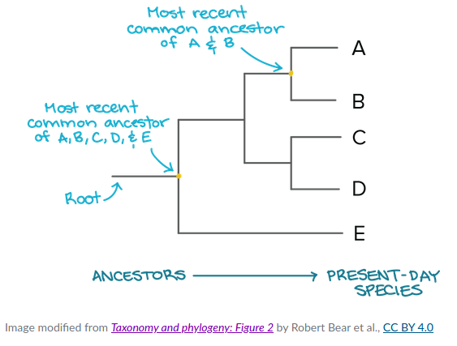

# Applications of Genomics in Wildlife Conservation

## Day 3 - Population genetic analysis - Session 2
In this session we are going to learn the basics of population genomics analyses using the babirusa dataset. We will conduct exploratory analyses to infer whether all the babirusa come from a panmictic population, or whether we can find evidence of population structure and, if this is the case, whether this structure correlates with geography.

In this tutorial you will run the three analyses on our remote server:
- building maximum likelihood tress in IQtree
- principal components analysis in smartpca
- ADMIXTURE with different values of K

In session three, you will then download the final output produced by these software and work in RStudio to plot the PCA and ADMIXTURE results while you will use `iTOL` to visualise the inferred tree directly in your web-browser.

As usual, we first need to create the directory structure for the whole session. Recalling the guidelines with went through on day 1, let's make a new folder in your home directory (`~/`) and a specific subdirectory for each of the analyses.

```sh
mkdir day3;
cd day3
mkdir iqtree; mkdir smartpca; mkdir admixture
touch what_i_did.txt
```

Next activate the correct conda environment for the day
> `Hint` - this will be the same as the one you were using this morning

### 1. Building phylogenetic trees with IQtree
As mentioned in the introduction to this practical session, a phylogetic tree is a diagram that represents the evolutionary relationships among a set of organisms. The pattern of branching in a phylogenetic tree reflects how lineages evolved from a series of common ancestors (see figure below). Phylogenetic inference relies on either morphological or molecular data and aims at identifying the best supported topology i.e. the shape and the structure of the tree that is able to explain the observed pattern of variations (see here if you want more details about tree reconstruction methods: https://en.wikipedia.org/wiki/Computational_phylogenetics). In this session we will focus on genetic variation (specifically on SNPs) and we will use for our inference `iqtree` .




#### Convert to phylip format
The program `iqtree` is a fast algorithm for inferring phylogentics tree using a maximum likelihood approach. It requires an alignment file as an input but this can take several formats. Here will be using the `.phylip` alignment format which can be easily generated from a vcf file using a python based utility called `vcf2phylip.py`. 

First of all, navigate to the correct folder for this analysis;
```sh
cd iqtree
```
Then, let's create a shell variable called `PANEL` which contains the path to the our input data.

```sh 
PANEL=/home/DATA/Day_3_b/babirusa_panel
```

To check whether the desired string has been correctly assigned to our variable, we can simply use the command `echo`
```sh
echo $PANEL
```
which should print on screen the path to the babirusa panel.

Then we can run the `vcf2phylip` utility by specifying the vcf file as the input (`-i`) and the output name you want in your current working directory (`--out-prefix`)

```sh
vcf2phylip.py -i $PANEL.vcf --output-prefix babirusa_panel
```
When it is finished you should see an output file in your `iqtree` directory, which, with default settings, has been named `[name_of_panel].min4.phy`

>  `Exercise one`
> 
>  Can you use the help file to find out what the addition of "min4" in the file name means? Now how would you run the command and change this option?
> `Hint` - use the help file (`--help`)

#### Basic usage of `screen` in linux
We now have our input file in the correct format for `iqtree` and we are almost ready to run our analysis. Unfortunately, the tree inference can take a while to complete, therefore we are going to use a program called `screen` that will allow us to launch multiple shell sessions. This way, the iqtree commands will keep running in the background as we continue with the other analyses. Below are some commands we will need for interacting with `screen`.

To activate new session with a specific name: 
```sh 
screen -S [name_of_session]
```

Lets call the session tree
```sh
screen -S tree
```

To detach a session you press `ctrl`+`a`+`d` at the same time 

To see what sessions are open use: 
```sh 
screen -ls
```

To reopen a session use: 
```sh 
screen -r [name_of_session]
```

To kill a session, i.e. close it forever, use:
```sh 
screen -XS [name_of_session] quit
```

#### Running iqtree
Now we have our input file and the basic understanding of screen we will run iqtree. 

Reopen the screen you made for running `iqtree`
```sh
screen -r tree
```
You should see that you have to reactivate the conda environment when you enter a new session. 

IQtree is a very versatile program with many options yet very straightforward to use. 

To run it we are going to specify some parameters:
> 1. The phylip alignment (`-s`)
> 2. The sequence type (`-st`)
> 3. The substitution model (`-m`) - if you omit this option iqtree runs an automatic model test. But it can take a while so we will specify this. 
> 4. The output file prefix (`-pre`)

The theory behind substitutions model in phylogenetics is beyond the scope of this tutorial. We'd be happy to discuss this with you in the classroom if you are interested - you can also check this wikipedia page for more information: https://en.wikipedia.org/wiki/Substitution_model

If you do not specify a model, `iqtree` runs a model test for all substitution models. This will take too long and use up to many resources so for now we will use the Generalised Time Reversible `GTR` model

The command is: 
```sh 
iqtree -s babirusa_panel.min4.phy -st DNA -pre babirusa_panel_tree1 -m GTR
```

If that is running, we will now let it in the background by deattaching the session (`ctrl`+`a`+`d`) and we will come back to it later.

### 2. Principal components analysis (PCA) in smartpca
PCA is a powerful statistical method widely used in population genomics to analyze and visualize patterns of genetic variation among individuals or populations. It helps researchers understand the underlying structure of genetic data and identify key trends that can be used to infer evolutionary relationships, migration patterns, and adaptation mechanisms.

In simple terms, PCA can be thought of as a technique that transforms a complex set of genetic data into a more manageable and interpretable form. It does this by identifying a set of new variables, called principal components (PCs), that capture the main axes of variation in the data. These PCs are essentially linear combinations of the original genetic markers, but they have the advantage of being uncorrelated with each other, making them easier to analyze and interpret.

Here we are going to use  `smartpca` to make a PCA from the babirusa data.  In your day three directory navigate to the pca sub-directory. 
```sh
cd ~/day3/smartpca
```

#### Convert files to the correct format
smartPCA does not recognise vcfs as input files. Thus, in order to analyse our dataset with this program, we need to perform a two-step file conversion (this is somehow very common in bioinformatics). First of all we need to convert our vcf file into a plink filest. Then we need use the `convertf` utility to transform these two tab separated files into a a format called eigenstrat that can be recognise by smartPCA. 

If you list the content of the directory `/home/DATA/Day_3_b/` you will see a series of files termed `babirusa_panel` with various extensions: `.vcf` (which you already know) plus a `.ped` and .map`. The latter represent a plink fileset i.e. pair of file that contain complementary information. These are tab (or space) separated files obtained by importing the vcf into `plink` and recoding the genotype information for each individuals in a slightly different way. This means that the first step has been already done for you but we have added the command below for full transparency ;)

```sh
insert the command here but start each line with #
```
Have a look for example at the `.map` file which contains all the info about our markers 
```sh
head -5 babirusa_panel.map
```
or at the .ped file which instead contains genotype information:
```sh
cut -f1-9 -d" " babirusa_panel.ped
```

Let's focus on the second step. `convertf` requires a parameter file (a.k.a. par), which contains the information on where the files we want to convert are located. The program can change between several different formats, for example - the current files are in the .ped format and would like the EIGENSTRAT format as the output. 

> `Hint` - take a look at the format and additional options here - https://github.com/chrchang/eigensoft/blob/master/CONVERTF/README

Make an empty text file and enter the text editor (`nano`).
```sh
touch par.convertf_PEDtoEIGENSTRAT
nano par.convertf_PEDtoEIGENSTRAT
```

Inside the `par` file we need to specify the location of your original plink .ped and .map file, our babirusa panel, define the output format that you require and then specify where you want to generate the new eigenstrat files. For us this will be in your working directory.

```sh
genotypename:  /home/DATA/Day_3_b/babirusa_panel.ped
snpname:       /home/DATA/Day_3_b/babirusa_panel.map 
indivname:     /home/DATA/Day_3_b/babirusa_panel.ped
outputformat:    EIGENSTRAT
genotypeoutname: babirusa_panel.eigenstratgeno
snpoutname:      babirusa_panel.snp
indivoutname:    babirusa_panel.ind
```
> save with an informative name (e.g `par.convertf_PEDtoEIGENSTRAT`) and exit the editor

Now run convertf using 
```sh 
convertf -p par.convertf_PEDtoEIGENSTRAT
```
Once completed, you should see the three new files in your working directory (*.eigenstrat, *.snp, *.ind)

#### Redefining the populations
Check the first few lines of the `.ind` file. What do you see? 

Column one is the sample name, column two is sex (U = unknown) and column three is population name.

If you use the `head` command, you can see that the third colummn is filled with `???` This means that the individuals in our panel haven't been assigned to a specific populationis unknown but as we dont want to make prior assumptions about the population membership of the individuals, we want each individual to be treated as an individual not as part of a population. Therefore we want to change this third column so each individual is considered as a unique population before we run the pca. The easiest way is to copy the first column to the third. This can be done using `awk`

```sh
cat babirusa_panel.ind | awk 'BEGIN {OFS="\t"};{print $1,"U",$1}' > babirusa_panel.ind_new
```

This command reads the .ind file with cat, this is then piped to awk which is printing the first field, followed by the "U" of the second field and then printing the first field again (i.e. the sample names). The output is written to a new .ind file. 

Then the original `.ind` file can be removed and rename the updated `.ind_new` file. Like this:
```sh 
rm babirusa_panel.ind
mv babirusa_panel.ind_new babirusa_panel.ind
```
These files can be used to run multiple types of analysis beyond PCA using the admixtools package (https://github.com/DReichLab/AdmixTools). We will stick to PCA for today though. 

#### Run smartpca
Our data is now ready to run `smartpca`. Like `convertf` we make a parameter file to supply to the program to generate the output files.

Again, make an empty text file and enter the text editor.
```sh
touch par.smartpca_babirusa
nano par.smartpca_babirusa
```

The same as the previous par file - specify the path to the input files (in eigenstrat format generated by the convertf command), followed by the path we want for the two output files.

```sh 
genotypename:  babirusa_panel.eigenstratgeno
snpname:       babirusa_panel.snp
indivname:     babirusa_panel.ind
evecoutname:   babirusa_panel_PCA.evec
evaloutname:   babirusa_panel_PCA.eval
```
> save with an informative name (e.g `par.smartpca_babirusa`) and exit the editor

There are many other options to add to the par file, which will depend on your data and the analysis you are conducting 
> `Hint` take a look at the documentation here: https://github.com/chrchang/eigensoft/blob/master/POPGEN/README

Now run `smartpca` and save the output to a log file
```sh 
smartpca -p par.smartpca_babirusa > babirusa_smartpca.log
```
This should give you two new output files, look at the contents of these files: 
- babirusa_panel_PCA.evec - this is the position of where each individual falls along the eigenvectors (columns 2:11) 
- babirusa_panel_PCA.eval - this contains the eigenvalues for each of the principal components (the importance of each axis)

> `Bonus exercise two`
>
> The default number of eigenvectors smartpca runs, the number of PC axis it will test, is 10. Using the help file and website can you modify the par file and generate new outputs for 15 eigenvectors? 

In the next session you will copy these files to your local computer and visualise in RStudio. But now lets move on to the admixture analysis.

### 3. ADMIXTURE analysis
The final analysis we will run is ADMIXTURE. ADMIXTURE is a software program for inferring individual ancestries and population structure from SNP data. It uses a maximum likelihood approach to estimate the proportions of each ancestral population in each individual. ADMIXTURE is a popular tool for population genomics research because it is relatively easy to use and can handle large datasets.

Make a new directory within your project folder for session two and navigate to it

The program `ADMIXTURE` runs directly from a `.bed` file. Great, we already have this in the right format. 
```sh
ls /home/DATA/Day_3_b/babirusa_panel*
```

So the command is very simple.
```sh 
admixture [path_to_bed] --cv [number_of_ks]
```
Here the option (`--cv`) calculates the cross validation error. When selecting values of k to cluster the data by, the lower the cv value the closer the fit to the data. 

> `Exercise three`
>
> Run ADMIXTURE for k = 2 with the cross validation error calculation, can you see the CV value in the output on your screen?

Next you can use a loop to run through several values of k, calculate the cv errors and output the results to a log file. This may take a little while, so again we will open a new screen, this means you can continue to use your terminal while it  is running. 
Lets look at the screens we have running: 
```sh 
screen -ls 
```
Hopefully you see the screen with your tree running

Then open a new screen with a sensible name: 
```sh 
screen -S admix
```
Remember - You will have to reactivate the conda environment before you start

First lets assign a variable for the path to the `.bed` file.
```sh
ADMIX=/home/DATA/Day_3_b/babirusa_panel.bed
```

Then make the for loop for clusters one to five 
```sh 
for k in $(seq 5) 
do
    admixture $ADMIX --cv $k | tee babirusa_k_$k.log
done
```
`tee` is just a command which writes the output to your screen while also writing to a log text file at the same time.

Close the session with `ctrl` + `a` + `d`

#### Lets check on the IQtree

Reactivate your screen session. To see which screens you have running, list them first:
```sh 
screen -ls
```
and then activate the one running IQtree
```sh 
screen -r tree
```
If it has not finished running leave it for longer while we have a break. Deattach the screen using `ctrl`+`a`+`d`
If it has finished - great. You can check the files in the directory for this analysis. You should have these output files: 
- .iqtree - the report file
- .treefile - the ML tree in NEWICK format (this is the file we will need to visualise in the next session)
- .log - the log file
- .ckp.gz - this is a check point file, if a run is interrupted and you need to resume
- .mldist - maximum likelihood distance matrix
- .bionj - contains the BIONJ tree, related to the neighbour joining tree

If you see these files, you can close that screen session.
```sh 
screen -XS tree quit
```

#### Lets check on the ADMIXTURE before coffee... 
Reactivate the admixture screen. Is it still running? 
```sh 
screen -ls
```
and then activate the one running the admixture
```sh 
screen -r admix
```

If you think its finished, close the screen and check whether the output files for all five values of k are in your output directory.

When it has finished running, use `grep` on the log files to extract the cv values, which we will look at after
```sh 
grep 'CV' *.log > cv_errors.txt
```

Make sure you have the correct output files in your directory and the close screen
```sh 
screen -XS admix quit
```


#### If you get here before the end of the session you can start downloading and organising your files
Follow the first steps in the next session - session 3 - and use `sftp` to download your files to your local computer


