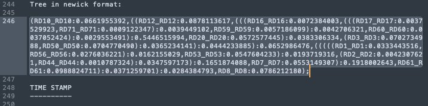

# Applications of Genomics in Wildlife Conservation

## Day three - Session three - Visualisation 
In this session we are going to visualise all our results from the previous session. We will be working mainly on our local computers in RStudio and the browser.

We will:
- download our output files via `sftp`
- generate figures in RStudio for the PCA and ADMIXTURE results
- Visualise the phylogenetic tree in iTOL (https://itol.embl.de/) 

### 1. Downloading the output files 
On your local computer we will use `sftp` to connect to the remote server and download the files.

In your terminal make a project directory where you would like to store the output files on your local computer. 

Then run `sftp` - this stands for secure file transfer protocol and will open a connection between your local comput and the remote server. 
We need to tell it where the ssh key is, and which remote server to connect using your username and the IP address. Therefore enter: 
```sh
sftp -i ~/path/to/ssh/key [your_username]@138.246.238.65
```
You will now be in your home directory in the server, it should show this: 
```sh
sftp>
```

You are now connected to the server and can navigate through your directories like normal. 
If you add an `l` in front of your commands you should see you local computer file structure. Using the command `get` will download your files to your location on the local computer. 

You need to download your output files

- .evec and .eval for the PCA
- .Q for the admixture
- .treefile and the .iqtree files for the tree
  
using something like this:
```sh
ls
get tutorial_PCA/*ev* .
```

You will also need to download some files from the shared directory `/home/DATA/Day_3_b/`
- you need the population_file.txt
- and the rooted tree file `XXXX.treefile
When you have done this, type this to close the connection.

```sh
sftp> bye
```

### 2. Visualising and comparing the trees
You should have two trees now - the one the you make (unrooted) and the one from the shared directory (rooted).

The rooting of the tree requires an outgroup and to save time we did this for you. Briefly we used the same panel to call SNPs at the same location in the outgroup - which is the pygmy hog. This is then merged with the original fileset. The tree is reran in iqtree, and it is easy to specify this sample in the command with the option (`-o`).

Open your browser and navigate to: https://itol.embl.de/

Then open the .iqtree file in a text editor and copy the NEWICK format tree at the bottom of the file 


Paste it into the box on the site, and press upload. 

ADD THE INSTRUCTIONS FOR THE UNROOTING

ADD THE ROOTED TREE

WHAT ARE THE DIFFERENCES

### 3. Visualising the PCA analysis
Next we will look at the results of the PCA using RStudio.

Start by opening RStudio and open a new script


We will write our code into the script window (top left), where we can save everything we write. 
The code will run in the terminal (bottom left). You can also run commands here, but they will not be saved.
The environment on the top right is where all your data, objects and variables are stored. 
Plots are viewed on the bottom right. 

TYPE SOMETHING IN THE TERMINAL AND RUN - HOW DO YOU RUN ON A WINDOWS VS MAC

Ok so now, its good practice to clean your environment, set your working directory and load the correct libraries you need at the top of your script. Like this: 

```sh
rm(list=ls()) 
```
This will clean up any variables from a previous session which might conflict. 

We then need to set the working directory - this should be the path to the project folder you made, where you downloaded the output files to. 

```sh
setwd("~/PATH/TO/PROJECT/DIRECTORY/")
getwd() # this should show your working directory location in the terminal
```

Now you load the libraries you need for this section.
> These will have needed to be installed first with install.packages(), this only needs to be done once

```sh
library(tidyverse)
library(ggrepel)
```

Now we will load in the metadata file we need for PCA. This contains the sample names and the region of Sulawesi that the sample comes from. 

Load the metadata file and name the columns:
```sh
samplelist <- read_tsv("pop_file.txt", col_names = c("sample", "region"))
```
> `Hint` - if your file is in your working directory the you just type the name of the file. But you can use `tab` to navigate to where your file is. 

Check the top of your dataframe:
```sh
head(samplelist)
```


```sh
# rename regions - condense into N/S/TO for babi
samplelist$region2 <- rep(NA, length(samplelist$region))
samplelist$region2[samplelist$region == "NW"] <- "North"
samplelist$region2[samplelist$region == "WC"] <- "North"
samplelist$region2[samplelist$region == "SE"] <- "South"
samplelist$region2[samplelist$region == "TO"] <- "Island"

all_pal<-c("#55b7a6", "#f25f5c","#f0b185","#50514f") # North, East, SE, Buton/Togian, other
all_pal_region<-c("#55b7a6","#9372C0", "#f25f5c","#f0b185","#50514f") # splits

#---------------------------------------------------------------------------------------------------------
## Load the output files from smartpca

# the eigenvalues
eval <- read.table("output_smartpca/babirusa_finalSet_qualFilt_geno0_maf0.05_LD0.1_sort_newNames.eval")
head(eval)

# the eigenvectors 
evec <- read.table("output_smartpca/babirusa_finalSet_qualFilt_geno0_maf0.05_LD0.1_sort_newNames.evec")
head(evec)

# calculate the percentage contribution of each PC axis
evec.pc1 <- round(eval[1,1]/sum(eval)*100,digits=2)
evec.pc2 <- round(eval[2,1]/sum(eval)*100,digits=2)

# clean up - removing the sample names from the end
evec2 <- evec[,-12]
head(evec2)

# add the regions for colouring the plot 
# ggplot requires everything to be in the same data frame 
evec_merge <- as.data.frame(cbind(evec2, sample = samplelist$sample, 
                                  region = samplelist$region, region2 = samplelist$region2))

#---------------------------------------------------------------------------------------------------------
## Set up the plot

# basic plot - remember it is the second and third column for the first and second PC 
# first column is the sample names
plot1 <- ggplot(data = evec_merge) + 
  geom_point(aes(V2, V3, colour = region), size = 4))

plot1

plot1 <- plot1 + xlab(paste0("PC1 (", evec.pc1, "%)")) + ylab(paste0("PC2 (", evec.pc2, "%)")) 

plot1


ggplot(data = evec_merge) + 
  geom_point(aes(V2, V3, +
  xlab(paste0("PC1 (", evec.pc1, "%)")) + ylab(paste0("PC2 (", evec.pc2, "%)")) 


ggplot(data = evec_merge) + 
  geom_point(aes(V2, V3, colour = region), size = 4) + 
  coord_equal() + # maintains the correct axis ratio between points
  theme_bw()


( a1 <- ggplot(evec_merge, aes(V2, V3, col = region)) + geom_point(size = 3) + 
    scale_colour_manual(values = all_pal_region) +

    ggtitle("babirusa_finalSet_qualFilt_geno0_maf0.05_LD0.1") +

    geom_text_repel(aes(label=sample), size = 3, max.overlaps = 50) +
    theme(text = element_text(size =10)) ) 

# save the file
# ggsave(plot = a1, "output_figures/PCA_babirusa_finalSet_qualFilt_geno0_maf0.05_LD0.1.pdf")
```


What do you think this tells us about the number of populations

### 4. Visualising the ADMIXTURE analysis
Based on these 


