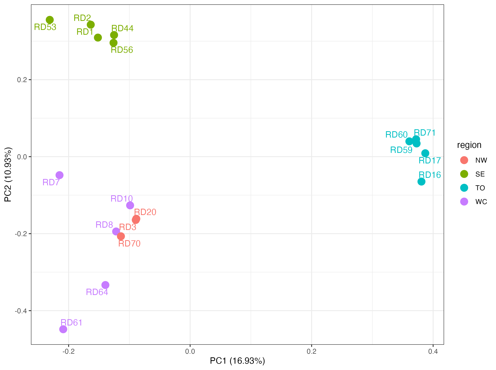

# Applications of Genomics in Wildlife Conservation

## Day three - Session three - Visualisation 
In this session the aim is to visualise the results of the analyses we just completed on the server. We will be working mainly on our local computers in RStudio and the browser.
We will:
1. download our output files via `sftp`
2. visualise the phylogenetic tree in iTOL (https://itol.embl.de/)
3. generate figures in RStudio for the PCA and ADMIXTURE results

### 1. Downloading the output files 
On your local computer we will use `sftp` to connect to the remote server and download the files.

In your terminal make a project directory where you would like to store the output files on your local computer. 

Then run `sftp` - this stands for secure file transfer protocol and will open a connection between your local comput and the remote server. 
We need to tell it where the ssh key is, and which remote server to connect using your username and the IP address. Therefore enter: 
```sh
sftp -i ~/path/to/ssh/key [your_username]@138.246.238.65
```
You will now be in your home directory in the server. 

In the screenshot you can see: 
- If you list the files (`ls`) you should see the files in your home directory
- If you add an `l` infront, so `lls` you should see the file structure for your local computer
- `pwd` shows the working directory in the server
- while `lpwd` shows the working directory on your local computer
 


We need to download your output files:

- From the PCA = `.evec` and `.eval`
- From the ADMIXTURE = all the `.Q` files and `cv_errors.txt`
- For the trees = `.treefile` and the `.iqtree`

Using the command `get` will download your files to your location on the local computer. 
The structure is like this: 
 ```sh
get [PATH/TO/REMOTE/FILE] [LOCATION/TO/PUT/FILE/IN/LOCAL]
```
> Hints - You can use `get -r ` to get the whole directory
> 
> If you are in the desired location on your local you can just use a `.`

You will also need to download some files from the shared directory `/home/DATA/Day_3_b/`
- you need the `population_file.txt`
- and the rooted tree file `babirusa_rooted.treefile`
When you have done this, type this to close the connection.

```sh
bye
```

### 2. Visualising and comparing the trees
You should have two trees now - the one the you make (unrooted) and the one from the shared directory (rooted).

The rooting of the tree requires an outgroup and to save time we did this for you. Briefly we used the same panel to call SNPs at the same location in the outgroup - which is the pygmy hog. This is then merged with the original fileset. The tree is reran in iqtree, and it is easy to specify this sample in the command with the option (`-o`).

Open your browser and navigate to: https://itol.embl.de/
L
Scroll down a little and click on the upload tree button

### Unrooted tree
First we will look at the unrooted tree you generated. So under the tree file box, navigate to your unrooted `.treefile` and click upload.

> Exercise
>
> Use the control panel on the right to make your unrooted tree look like this example below


### Rooted tree
Now lets do the same for the rooted tree, in a different browser window so you can compare. The first thing to do is specify the root.

> Exercise
>
> By hovering over the samples, root the tree by the correct sample

It is possible to add colours for regions, change and format lines etc, but for speed we will just compare the clustes we see on our tree to the metadata file. If you finish the session, this is something you can play around with. But for now, open your population metadata file, which contains the sample IDs and regions

### Questions:
- when you consider the region of origin for each individual, do you think there is evidence of geographic clustering?
- what is the difference between the tree with and without the outgroup?

### 3. Visualising the PCA analysis
Next we will look at the results of the PCA using RStudio.

Start by opening RStudio and open a new script (pink arrow in the screenshot).


- we will write our code into the source window (top left), where we can edit and save everything we write. 
- the code will run in the terminal (bottom left). You can also run commands here, but they will not be saved.
- the environment on the top right is where all your data, objects and variables are stored. 
- plots etc are viewed on the bottom right. 

When we write something in the script, it is not run until you source it. 
First highlight the code you want to run then:
- mac - press `cmd` + `entr`
- windows - press `ctrl` + `entr`

Ok so now, its good practice to clean your environment, set your working directory and load the correct libraries you need at the top of your script. Like this: 

```sh
rm(list=ls()) 
```
This will clean up any variables from a previous session which might conflict. 

We then need to set the working directory - this should be the path to the project folder you made, where you downloaded the output files to. 

```sh
setwd("~/PATH/TO/PROJECT/DIRECTORY/")
getwd() # this should show your working directory location in the terminal
```
You can see above that anything your write with a `#` will not be run - it is a comment

Now you load the libraries you need for this section.
> Hint - These will have needed to be installed first with install.packages(), and this only needs to be done once

```sh
library(tidyverse)
library(ggrepel)
library(ggpubr)
```

Now we will load in the metadata file we need for PCA. This contains the sample names and the region of Sulawesi that the sample comes from. 

Load the metadata file and name the columns:
```sh
samplelist <- read_tsv("pop_file.txt", col_names = c("sample", "region"))
```
> `Hint` - if your file is in your working directory the you just type the name of the file. But you can use `tab` to navigate to where your file is. 

Check the top of your dataframe, you want to see the two columns
```sh
head(samplelist)
```

Next you want to make a new column which groups the samples from the north together.
First you make an empty column that is the length of the dataframe
```sh
samplelist$region2 <- rep(NA, length(samplelist$region))
```

Then you want to assign a new group based on the original grouping. So for the Southeast lets rename it to a group called "South" 
```sh
samplelist$region2[samplelist$region == "SE"] <- "South"
```
> Exercise
>
> Rename the Togean babirusa to a group called "Island" and then assign both the Northwest and Westcentral babirusa to a "North" group.

Next you will read in the datafiles, for the pca there are two files we need, `.evec` and `.eval`.
```sh
eval <- read.table("PATH/TO/FILE.eval")
head(eval)
```
> Exercise
>
> Can you read in the `.evec` file and check that it has been correctly loaded - there should be 12 columns

Using the eigenvalues, we can calculate the percent contribution of each PC axis to the variation in the samples. This is for the first two axis.
```sh
evec.pc1 <- round(eval[1,1]/sum(eval)*100,digits=2)
evec.pc2 <- round(eval[2,1]/sum(eval)*100,digits=2)
```

We will plot the PCA using ggplot and first we will add the metadata information to the eigenvectors dataframe.  

```sh
evec_merge <- as.data.frame(cbind(evec[,-12],
                                  sample = samplelist$sample,
                                  region = samplelist$region,
                                  region2 = samplelist$region2))
```
- `cbind()` function binds the columns together
- we take all but the last column of the eigenvector df (this was an additional sample name column)
- plus the metadata columns we want - the formate is `[name_of_column] = [location_of_column]`
- `as.data.frame()` function ensures that it stays in a data frame format

Now we are ready for plotting using the function ggplot. ggplot is a very comprehensive package with many options. We will just try and keep it simple but if you have experience with it, go ahead and add options ontop. 
The plots are built in layers, with each layer being added to the basic plot using (`+`). 
The style of plot is determined by the `geom` functions - for a scatter plot we want to use `geom_point()`

First lets make a basic scatter plot:
```sh
ggplot(data = evec_merge) + 
  geom_point(aes(x = V2, y = V3, colour = region), size = 4)
```
Lets unpack this
- the inital ggplot command determines the dataframe (`data = evec_merge`) to be used
- the `geom_point()` specifies the point or scatter plot we want
  
Then we specify the aesthetics (`aes`) within the geom function. These are the necessary values to build the plot correctly.
- the x-axis is specified as the second column which are the values for PC1
- the y-axis is specified as the third column which are the values for PC2
- the points will be coloured by the region factor - this is important so we can see if there are any distinctive clusters
- size determines the size of the point

Lets make this an object called `pca_plot`

Do the same thing again but specify an object name. 
```sh
pca_plot <- ggplot(data = evec_merge) + 
  geom_point(aes(x = V2, y = V3, colour = region), size = 4)

pca_plot
```

This is your basic PCA plot. You could stop here - but there are many other options that we could add, and just adding a couple can make the figure much clearer for the reader.
First lets add the percentage contribution to each axis, this gives an indication of how important each axis is to the genetic structure.
```sh
pca_plot <- pca_plot + xlab(paste0("PC1 (", evec.pc1, "%)")) + ylab(paste0("PC2 (", evec.pc2, "%)")) 
```

Next lets make the plot look a little cleaner. ggplot has lots of built in `theme` options.
```sh
pca_plot <- pca_plot + theme_bw()
```
> Hint - start typing `theme_` and then use the tab to see the different options

You are saving the layer ontop of the initial object, so be warned if you want to make changes or clear something you will have to run the code from the beginning.

Finally - we will add the sample names. This is useful so that we can identify any outliers in the data or interesting individuals. Because this needs a new geom, we will give this to a new object so we do not confuse R.

```sh
pca_plot_names <- pca_plot + geom_text_repel(aes(x = V2, y = V3, colour = region, label=sample))

pca_plot_names
```


> Hint - use `?ggplot` or `?geom_point` to read the help files and there is alot of help online

You save the plot using:
```sh
ggsave(plot = PLOT_NAME, "PATH/TO/FILE.png")
```
### Questions:
- when you look at the PCA, what do you see and what do you think this means for the babirusa population?
- do you think that there is evidence of population structure and how many populations do you this these samples from?

### 4. Visualising the ADMIXTURE analysis
Great, now lets move on to plotting the admixture results. You can keep going in the script, but remember to save it every so ofter. 
We want to use the same metadata file as for the PCA, so lets not clear our environment. 

First we need to read in the `.Q` files we downloaded from the server. 
```sh
k2 <- read.table("PATH/TO/FILE.Q")
head(k2) # you should see two columns "V1" and "V2" 
```
The columns V1 and V2 correspond to the ancestry proportions, and the number of columns will change with the values of K
> Exercise
>
> Can you read in the additional Q files for the each of the clusters you ran?

Again, the first thing we need to do is get the dataframe in the correct format. We can use the `cbind()` function from before, or because we also need to get the data into longform format, we can achieve this using the `tidyverse` (of which ggplot is part of). Long form means that each row in the dataframe only has one value, whereas our data is currently in wide form - there are two values for each individual on each row (V1 & V2). 
We do this using:
```sh
k2_long <- k2 %>% bind_cols(samplelist, k = "k2") %>% 
  pivot_longer(cols = 1:2)
head(K2_long)
```
Lets look at this
- first we call the data (`k2)
- `%>%` is a way of piping from one command to the next in the package `tidyverse` - similar to the `|` in UNIX
- the function `bind_cols()` is similar to the base R function we used earlier `cbind()` and adds columns together. At the same time we can add a column to specify the value of K
- the function `pivot_longer()` converts it to long form - the number of columns relates to the number of columns in the .Q matrix


> Exercise
>
> Can you modify this code now for your other values of k?

Now we should have a long form data frame object for every cluster with the metadata (samples and regions) attached. 

Using this we will make the stacked barplots using `geom_col()`, this is for a barchart where the bars will mean that the bars add up to 1.
We plot in ggplot using the same process as before. First we can make the basic plot:
```sh
admix_plot_k2 <- ggplot(data = babik2_L) +
    geom_col(aes(x=sample, y=value, fill=name)) +
    scale_y_continuous(expand = c(0,0))
```
- start with specifying the data
- then we specify the geom and the aesthestics for the bar plot
- the final option (`scale_y_continuous(expand = c(0,0))`) is just to make the bars extend to the bottom of the x-axis

Take a look at the plot, can you tell anything about whether the babirusa from the same region show the same patterns of ancestry? Probably not quite yet as the bars are just in the order R has read the sample column in the metadata. 
We need to split up the columns by the regions, the quick way to do this is with facets. 
To the base plot add this line: 
```sh
admix_plot_k2 <- admix_plot_k2 + facet_wrap(~region, scales = "free", nrow = 1)
```
- this is the function `facet_wrap()` where we specify we want it to be split by region
- `scales = "free"` stops R trying to plot every sample in every region
- and `nrow = 1` makes sure they are in a line, and not in a square
> Hint - try running it without these options, what do you see?

Finally to make the names readable and label the y axis correctly we can add: 
```sh
admix_plot_k2 <- admix_plot_k2 + theme(axis.text.x = element_text(angle = 60, hjust = 1)) +
 ylab("Admixture proportion")
```


> Exercise
>
> Save this plot and generate the remaining plots for your clusters? 

When you have made the plots of all the values of k, we can visualise them ontop of each other using a function called `ggarrange` in the `ggpubr` package.

You specify the plots you would like to view together, and then the option `ncol = 1` indicates you want them all in one column i.e. ontop of each other.
```sh
admix_all_plots <- ggarrange(admix_plot_k2, admix_plot_k3, admix_plot_k4, admix_plot_k5, ncol = 1)

admix_all_plots
```

Do not forget to save your script as you go.

### Questions: 
- what do you think this analysis tells us about the ancestry of the babirusa?
- open up the cv.errors.txt file - what does this suggest is the most fitting number of clusters? Why might this be?
- are there any individuals that look like they are admixed, i.e. show evidence of multiple ancestries?

### Now that you have the results of all three exercises: 
1. do the analyses agree?
2. what do you think we can conclude overall about the population structure of these babirusa?
3. which region is the most genetically distinct and why might this be?

### 5. Extra exercises
Extra tree exercises 
>
> Can you add the regions and colours to the tree?
>
> Why do we ignore the branch lengths?
>

Extra PCA exercises
>
> Can you add the sample names to the plot using the function `geom_text_repel()`
> 
> Can you re-colour the points based the three clusters inside of four?
> 
> Can you use scale_colour_manual() to choose your own colour palette?
>
> Plot on the different PC axis and calculate the variation for these
>

Extra ADMIXTURE exercise
>
> could you change the plots to be a better representation of the population clusters
