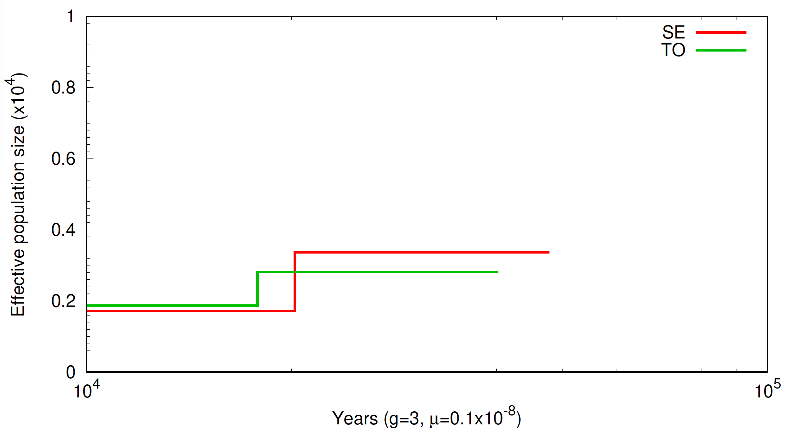
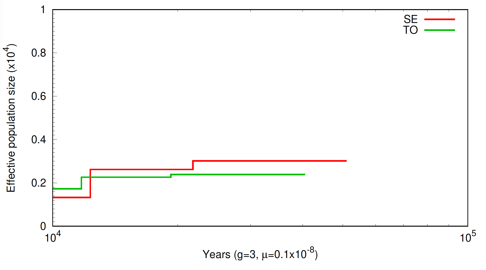
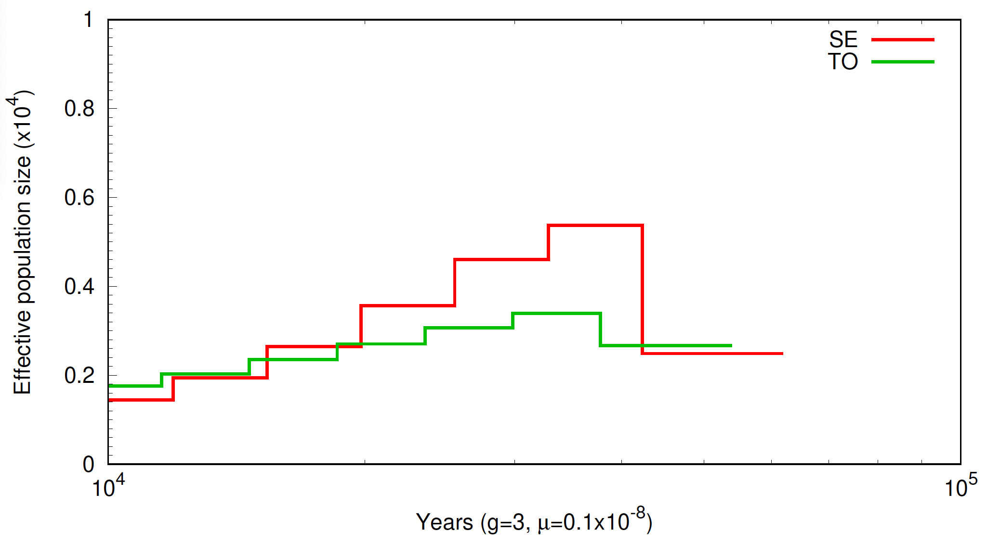

# Applications of Genomics in Wildlife Conservation

<!---
[comment]: # please do not modify these first two lines of the .md file
[comment]: # use the same syntax to add pictures:
[comment]: # placeholder name within square brackets and ../IM/file_name.png within parentheses
--->

## Inferring Ancient Demography with PSMC

### Introduction

The Pairwise Sequentially Markovian Coalescent (PSMC) is a statistical method used to infer demographic history from genomic data. It is a powerful tool that can be used to estimate changes in population size over time, as well as to identify ancient population bottlenecks and expansions. In this tutorial, we walk through the steps to generate the necessary input data for PSMC and run it on our babirusa data set to see how well we can estimate effective population size changes through time.

We will use the `psmc` tool to estimate the effective population size for our data, which are four babirusa individuals, RD70 from Northwest Sulawesi, RD64 from West Central Sulawesi, RD44 from the Southeast Sulawesi, and RD71 from Togean. Later on, we will also try to run `psmc` on human data from the 1000 human genomes consoritum as a species comparison. The samples are 2 human individuals, NA12718 - a CEU female sample (Northern European ancestry), and NA19471 - a female Luhya sample from Kenya. We will use a variant calling format (vcf) file as the starting point. 

### Task 0: Preparing your working directory

Before starting this first session, activate the conda environment containing all the software we are going to use today as follows:

```sh
conda activate Day_4
```

In this exercise, you will need the following input files which you can find in `/home/DATA/Day_4`:
```sh
NA12718_chr1.psmc    NA19471_chr1.psmc    RD44.vcf.gz      RD64.vcf.gz      RD70.vcf.gz      RD71.vcf.gz      babirusa_workshop_metadata.txt
NA12718_chr1.psmcfa  NA19471_chr1.psmcfa  RD44.vcf.gz.tbi  RD64.vcf.gz.tbi  RD70.vcf.gz.tbi  RD71.vcf.gz.tbi  chr_autosome.txt
```
The `.tbi` file is an index. Indexing VCF files is a crucial step in facilitating efficient data retrieval and analysis for large-scale genomic studies. Indexing creates a data structure that allows tools to quickly access specific genomic regions or variants within large VCF file, significantly improving performance for various tasks using programs like bcftools. 

Make your own directory for this project and use a symbolic link for easy access to your working directory:
```sh
mkdir day4_psmc_tutorial
cd day4_psmc_tutorial
ln -s /home/DATA/Day_4/Session_1/* .
```

Now we are good to go.

### Task 1: Preparing input file for PSMC

PSMC works on a psmcfa file of a single diploid sample. A `psmcfa` file is a fasta-like representation of the genome which keeps track of where heterozygous variant are located in the genome.

> Food for thought: Can you guess why RD44 is chosen? Hint: Have a look on the metadata.

Conventionally, a single individual psmcfa is generated from a consensus fasta generated from a BAM file. However, this will take some time so we will instead generate the consensus sequence from a VCF file using `samtools faidx` and `bcftools consensus` below:
```sh
REF=/home/DATA/Day_2/SUS_REF/Sus_scrofa.Sscrofa11.1.dna.toplevel.fa
samtools faidx $REF -r chr_autosomes.txt | bcftools consensus RD44.vcf.gz > RD44.fa
```
Note that we need the pig reference genome to do this, and a file with the autosomes list on `chr_autosomes.txt` to keep our analysis within the autosomal chromosomes.

> Food for thought: Why don't we use mitochondrial and sex chromosome?

After getting our consensus fasta, we construct our psmcfa file using `fq2psmcfa`.
```sh
fq2psmcfa RD44.fa > RD44.psmcfa
```

<details close>
<summary>Have a look on the result using `head` command. What do you see?</summary>
<br>
It appears to be a regular fasta file, with only "T" and "K". Here a "T" represents a 100 bp window without any heterozygous sites in it, whereas a "K" represents a 100 bp window with at least 1 heterozygous site in it.
</details>

Lets repeat the same procedure for `RD71.vcf.gz`.

> IMPORTANT: Remember that this is **NOT** the prefered method to generate input files for `psmc`. The prefered method is to generate the input files directly from bam files, and that information can be found [here](https://github.com/lh3/psmc).

### Task 2: Running PSMC

Now it is time for us to run our first psmc analysis. Let us first look at the options for running PSMC by running `psmc` on the command line.

```sh
psmc
```

PSMC reconstruct population changes over time in accross time intervals. The number and length of these interval is controlled by the -p option. This option allows us to divide up time into discrete time intervals. 

For example, the default pattern "4+5\*3+4" splits time into 23 intervals (4+15+4). The first 4 time intervals will have the same effective population size parameter, then the next 3 intervals will be allowed to have a different parameter. This is repeated 5 times (5\*3 time intervals = 15 parameters) then the last 4 intervals will have one effective population size parameter. In total with have 23 time intervals for 17 parameters (i.e. possible different values of effective population size). We can see that the more we divide this up the more resolution we can expect. The data, however, may not not be sufficiently informative to assess population size changes at a very fine scale.

`Quick Exercise`
How many time intervals and free effective population size parameters are you expecting when specifying -p "4+25*2+4+6"?

Let us now run psmc for the first time - we will just use the default values for the options, while still explicitly specifying the parameter pattern. This pattern is quite coarse, but we will try and estimate it again with more parameters per time intervals in the next section.

```sh
psmc -p "4+5*3+4" -o RD44_coarsePattern.psmc RD44.psmcfa &
psmc -p "4+5*3+4" -o RD71_coarsePattern.psmc RD71.psmcfa &
```

As we have done this for whole autosomal genomes, this will take ~20 minutes. While we wait for it to finish, let's try have a look at what happens when we run psmc only one chromosome.

### Task 3: Running PSMC in chromosome 1

To run PSMC on one chromosome only, we need to prepare a psmcfa for only one chromosome.

<details close>
<summary>Can you guess how it is done?</summary>
<br>
  See the steps on Task 1. We need to first single out chromosome one as we make the consensus fasta and made a .psmcfa.
  ```sh
  REF=/home/DATA/Day_3_b/SUS_REF/Sus_scrofa.Sscrofa11.1.dna.toplevel.fa
  samtools faidx $REF 1 | bcftools consensus RD44.vcf.gz > RD44_chr1.fa
  fq2psmcfa RD44_chr1.fa > RD44_chr1.psmcfa
  ```
</details>

After having the psmcfa of chr1 from both samples, run the same command as Task 1:
```sh
psmc -p "4+5*3+4" -o RD44_1_coarsePattern.psmc RD44_chr1.psmcfa &
psmc -p "4+5*3+4" -o RD71_1_coarsePattern.psmc RD71_chr1.psmcfa &
```

This should run within a minute. Let's have a look on one of the output files:
```sh
tail -34 RD44_1_coarsePattern.psmc
```

> Exercise 3.1:
>
> Modify the -p option to have finer resolution. Use "4 + 10*2 + 4 + 6" and “4 + 25*2 + 4 + 6”.
> Name the resulting files differently. For example, adding suffix "fine_a.psmc" and "fine_b.psmc".

### Task 4: Plotting PSMC

Let us now cat the psmc outputs for all 2 samples, and plot them into a pdf.
```sh
cat RD44_1_coarsePattern.psmc \
    RD71_1_coarsePattern.psmc > combined_coarsePattern.psmc 
```

To simplify the psmc results, we need to parse the .psmc file with `psmc_plot.pl`. First let have a look on this script to see what it does.
```sh
psmc_plot.pl
```

An important thing here is to make sure we use the correct mutation rate and generation time. Because there is no mutation rate estimates yet for babirusa, we used a mutation rate estimated for domestic pigs. We set the average generation time as expected for babirusa in captivity.
```sh
psmc_plot.pl -u 1.5e-09 -g 6 -s 100 -Y 1 -m 5 -n 30 -p -M "SE, TO" babirusa_chr1_coarse combined_coarsePattern.psmc 
```
Note that "SE" and "TO" stands for the different population assignment of RD44 and RD71 respectively.

> Exercise 4.1:
>
> Re-run the entire command for Task 4 with the results of Exercise 3.1.
> Do not forget to choose different prefix name for files from different parameters!
> For example, babirusa_chr1_fine_a and babirusa_chr1_fine_b

By this stage, you should have three pdf files, each coming from different -p option. To see how they look like, we need to download the output into our local machine using sftp:
```sh
sftp -i <path_to_identity_file> username@138.246.238.65
> get babirusa_* .
```

###Rasmus comment: I would show the whole time axis in these plots. 1st because at present you are only showing a small subset of the free parameters that are being estimated, which may not be pedagogic given that you ask them to play around with the number of free parameters. 2nd because it allows you to make an important point: that although PSMC gives you a population size estimate over a long time scale, one should be careful about interpreting it in the recent and old parts of the history.######


The plot should look somewhat like this:

Babirusa PSMC with coarse parameter           |  Babirusa PSMC with fine parameter (4 + 10*2 + 4 + 6)                | Babirusa PSMC with fine parameter (4 + 25*2 + 4 + 6)
:--------------------------------------------:|:---------------------------------------------------:|:---------------------------------:|
  |   | 

This plot is may look different from the exercise because it was made with option `-g 3`. Does specifiying different generation time matters?

> Exercise 4.2:
>
> Re-run commands from Task 3 and 4 to the resulting whole genome psmc you did in Task 2. Compare the result of this coarse pattern. How are they different?

> Exercise 4.3:
>
> Re-run Task 3 to 4 on RD64 and RD70 to get the coarse psmc of chromosome 1 of these samples and plot them together with the other two samples. How are they different?

### Task 5: Looking at human population

We are now going to shift gears to estimate the effective population sizes from 2 samples in the 1000 human genomes consoritum. We will compare and contrast how the effective population sizes vary between these two populations.

We will only be using data from chromosome 1 due to time constraints. Further, we have already run the commands that generate the psmcfa files using our custom script, so you do not need to do that.

> Exercise 5.1
>
> The psmcfa files are called NA12718_chr1.psmcfa and NA19471_chr1.psmcfa. Using the same sets of commands we used in the previous section, run psmc on these 2 samples using the pattern "4+25*2+4+6". Note that this will take about 10 minutes to run.

If you are short on time, or are tired of waiting, I have the psmc files for these samples already generated. They are called NA12718_chr1.psmc and NA19471_chr1.psmc. Use the plotting command - you might have to remove the -Y option from the command from the last section - to plot these.

> Exercise 5.2
>
> Task 2: Remember that we now plot a different species, the human species. Consequently, the plotting parameters is different. Run `psmc_plot.pl -u 2.5e-08 -s 100 -m 5 -n 30 -p -M` with the `psmc` files to get the result.

> Question: Based on what you see in the human population PSMC, what would you conclude regarding the population size history of the two populations of babirusa - did they have large or small populations, and were their population sizes similar over time?
