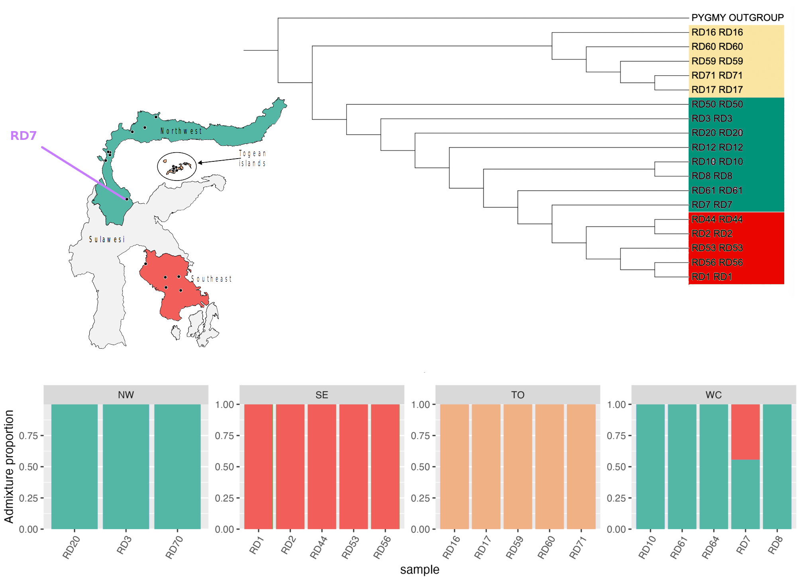
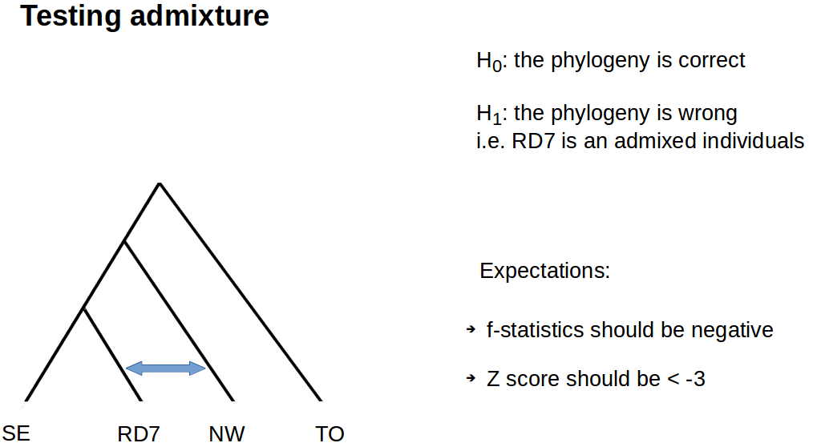

# Applications of Genomics in Wildlife Conservation

## Day 5 - Modelling gene flow 
In this session we will explore the `admixtool` suite and run some tests using f-statistics.

### Introduction

In day three you should have obtained these results from the PCA, iqtree and admixture analysis



Today we are going to test the support for the topology obtained from iqtree and whether RD7 is truely admixed

Before we start we should create the directory structure:
```sh
mkdir day5_fstat
cd day5_fstat
mkdir par;
ln -s /home/DATA/Day_5_s1/ ~/day5_fstat/raw_data
```
In your `raw_data` folder you should see a plink file set consisting of two files, namely `chr10.ped` and `chr10.map`. In order to use them for our practical we need to convert them into eigenstrat format (like you did on day 3).

Like always - we will activate our conda env first
```sh
conda activate Day_5_s1
```

Let's start preparing the parameter file `~/day5_fstat/par/convertf.par` for conversion:
```sh
cd par
touch convertf.par
nano convertf.par
cd ..
```

Then inside the `convertf.par` file you need to include the following:
```sh
genotypename:  ./raw_data/chr10.ped
snpname:       ./raw_data/chr10.map 
indivname:     ./raw_data/chr10.ped
outputformat:    EIGENSTRAT
genotypeoutname: ./chr10.eigenstratgeno
snpoutname:      ./chr10.snp
indivoutname:    ./chr10.ind
```
Now you are ready to convert your file, please run this from `day5_fstat`

```sh
convertf -p ./par/convertf.par
```

You should now see the standard eigenstrat file set in your day5_fstat directory - three files `.eigenstratgeno`, `.snp`, `.ind`
Again, like day 3, we need to modify the `.ind` file  

```sh
cat chr10.ind | awk 'BEGIN {OFS="\t"};{print $1,"U",$1}' > chr10.ind_new
rm chr10.ind
mv chr10.ind_new chr10.ind
```

In order to calculate our f4 statistics, we need to prepare a configuration file for the program `qpDstat`. Which we will call `dstat.null.par` and should contain:
```sh
genotypename:  chr10.eigenstratgeno
snpname:   ./chr10.snp
indivname:   ./chr10.ind
popfilename:  ./par/null_test.txt
f4mode: YES
```

Finally we need to specify inside `./par/null_test.txt` file, which test we want to run. 
Therefore create this file inside the par directory - with the following contents
```sh
RD17:RD17 RD16:RD16 RD1:RD1 RD2:RD2
RD71:RD71 RD17:RD17 RD10:RD10 RD2:RD2
RD44:RD44 RD2:RD2 RD20:RD20 RD17:RD17
```
As you can see we are running three test (one per line) each involving 4 individuals (we are calculating f4s). The figure below shows the three tests we are specifying in the `./par/null_test.txt` file for the program to run.
The tests are:
1. two individuals from Togean (RD17, RD16) and two individuals from southeast(RD1, RD2) 
2. two individuals from Togean (RD71, RD17) and one north (RD10) and one southeast (RD2)
3. two individuals from the southeast (RD44, RD2) and one north (RD20) and one togean (RD17)
For each of the tests we assume that the topology obtained from iqtree is the correct one


To get the test results we just need to run
```sh
qpDstat -p dstat.null.par
```
> Exercise one
>
> Run the test above, do we get the results we were expecting?

Now we are going to use the f4 statistic to test for admixture in RD7. 
Again we need to prepare the parameter file for the `qpDstat` program and this time we will call it `dstat.admix.par` and should contain:
```sh
genotypeoutname: ~/day5_fstat/chr10.eigenstratgeno
snpoutname:      ~/day5_fstat/chr10.snp
indivoutname:    ~/day5_fstat/chr10.ind
popfilename:  ./par/admixture_test.txt
f4mode: YES
```

We need to make the par file containing the test again so inside a file called `./par/admixture_test.txt` file we need the following contents:
```sh
RD1 RD7 RD3 RD71
RD56 RD7 RD8 RD17
RD2 RD7 RD20 RD60
```
The figure below contains the hypotheses we are testing here and our expection about these tests


Finally to run the test, we simply use: 
```sh
qpDstat -p ./par/dstat.admx.par
```

> Exercise two
>
> Run the command above, do you think RD7 is really admixed?


