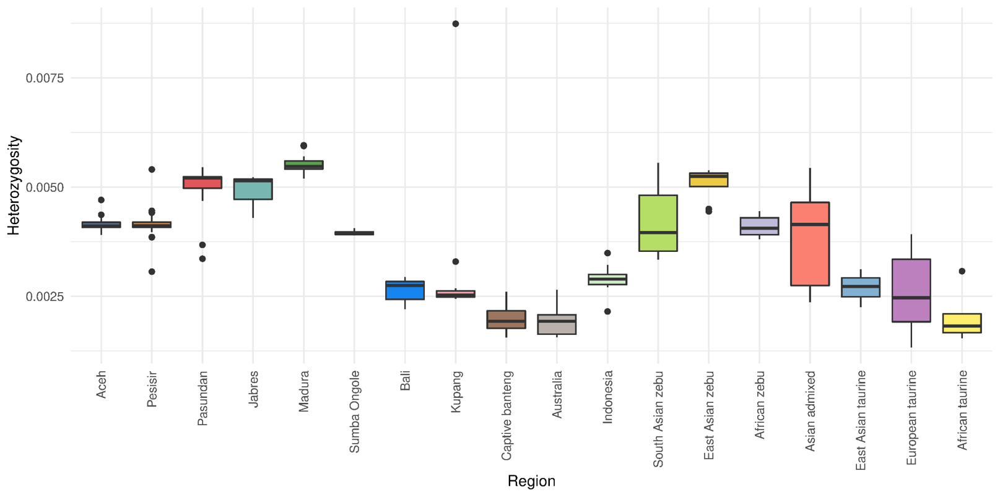
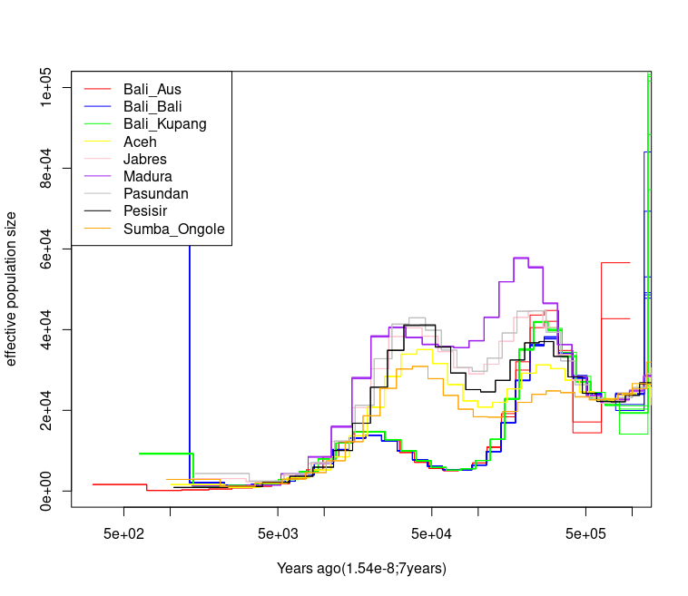
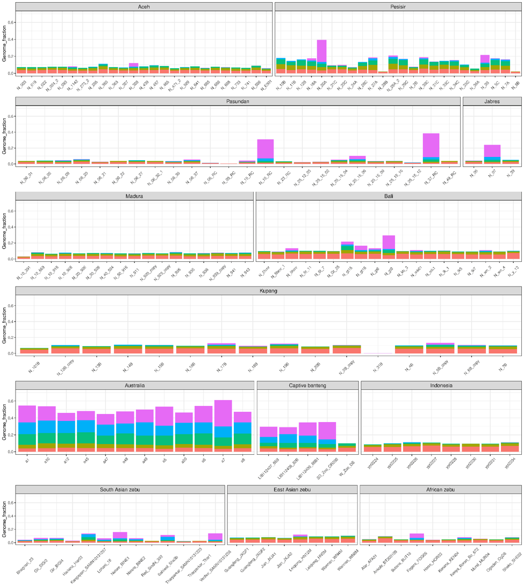
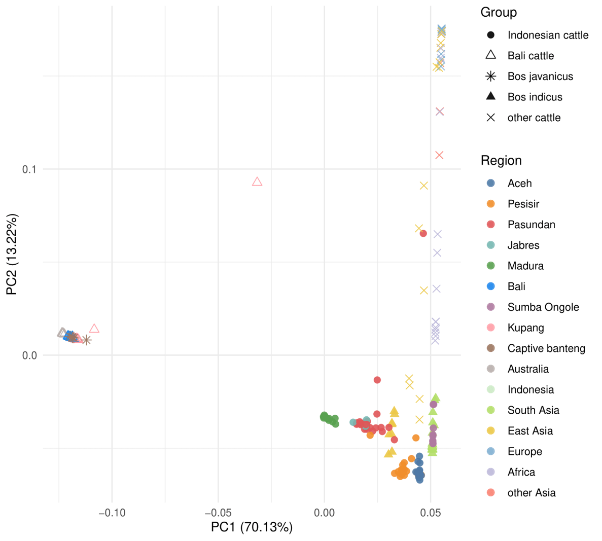
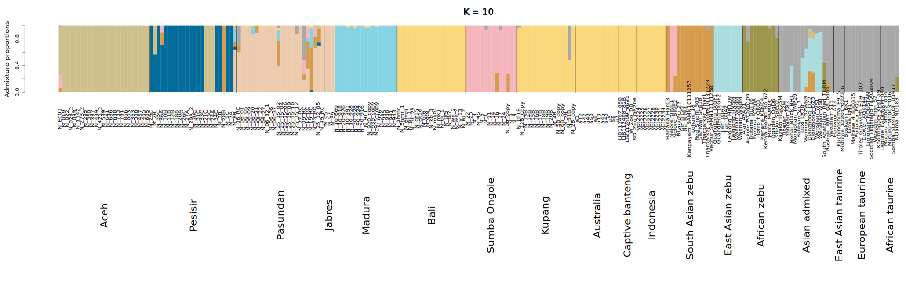

# Applications of Genomics in Wildlife Conservation
<!---
please do not modify these first two lines of the .md file

use the same syntax to add pictures:

placeholder name within square brackets and ../IM/file_name.png within parentheses
--->

## Day 5 - An interactive case study - Session 2
This session is an “interactive case study” – we will try to see if we can interpret some advanced population genetic analyses! And hopefully see some interesting research.

Below you will find some questions and some images/plots to help you answer the questions. In parallel, we will be showing slides that introduce the background and explain what you see on the plots. For each question, you will get 5-10 minutes to discuss in pairs or small groups. After that, we will discuss the questions for 5-10 minutes in plenum. We hope you will not be shy about offering your opinion during the discussion!

If there is not enough time, e.g. if we get absorbed in some really interesting discussions along the way, don't fear. You can try to see if you can answer the remaining questions on your own time.

 

### Discussion questions 
Please follow the slide show which will tell you when to discuss/answer the different questions. For each question, there will first be a plot, followed by the question for discussion.

#### Demographic history and genetic diversity
Cattle and banteng heterozygosity           |  Cattle and Bali cattle PSMC                |
:--------------------------------------------:|:---------------------------------------------------:|
   |    

> Question 1 (5 minutes in pairs/groups):
>
> Which populations do you think have the highest genetic load?

 

#### ROHs and inbreeding

> Question 2 (5 minutes in pairs/groups):
>
> What happened in samples N_19_RC and N_37_RC from Pasundan?
> 
> Question 3 (5 minutes in pairs/groups):
>
> What happened in Australian banteng?

 

#### Genetic structure - PCA

> 10 minutes discussion for the next three questions
> 
> Question 4:
>
> Why are taurine cattle so spread out?
>
> Question 5:
>
> Why is one Kupang Bali cattle in the middle?
>
> Question 6:
>
> Can you explain the Madura cattle?

 

#### Genetic admixture

> Question 7 (5 minutes):
>
> Are cattle breeds genetically “pure”?
> 

 
